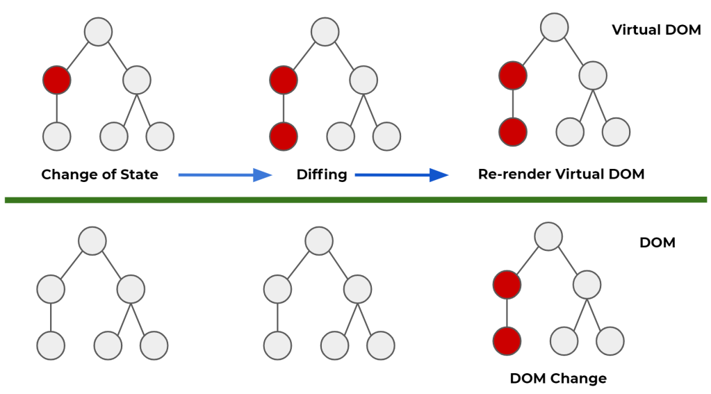
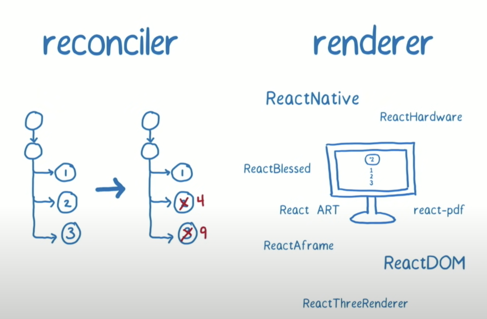

# Virtual DOM이란 무엇인지 왜 이 기술을 사용했는지 어떤 역할을 하는지 설명해주세요.

- 초기 답변
> Virtual DOM은 실제 DOM을 추상화한 가상의 DOM으로, 상태값이 변화하기 이전의 Virtual DOM과 이후의 Virtual DOM을 비교하여 달라진 점만 렌더링을 수행하여 효율적으로 업데이트를 수행합니다.

## Virtual DOM이란?
### DOM이란?
- DOM(Document Object Model) : HTML, head, body와 같은 태그들을 JS가 이용할 수 있도록 트리구조로 만든 객체 모델
  - DOM이 존재하기에 JS로 HTML 태그들을 수정할 수 있다.
    - `document.getElementById('id').innerHTML = 'Hello World'`
  - `window`라는 객체의 하위에 있는 `document` 전역 객체를 통해 접근
  - HTML을 파싱해서 만든 것

```js
import React from 'react';
import ReactDOM from 'react-dom';
import './index.css';
import App from './app';

ReactDOM.render(
	<React.StrictMode>
  		<App />
  	</React.StrictMode>,
  	document.getElementById('root')
);
```
- React17 이전 코드

```js
const root = ReactDOM.createRoot(document.getElementById('root'));
root.render(<App />);
```
- React17 이후 코드

- React는 순수 Javascript이고, 이 Javascript를 이용해 컴포넌트를 만들어나간다.
- 위 코드와 같은 식은 `babel`을 이용해서 순수 Javascript로 변환된다.
- 그러고 나서 우리가 만든 컴포넌트를 `html`과 연결하는 작업을 하는데 이것을 해주는 것이 바로 `react-dom`이다. 그래서 사용자에게 궁극적으로 배포되어지는 것은 `index.html`이다.
- `document`에서 `getElementById`를 통해 `root`라는 `id`를 가진 요소를 가져와서 `<div id="root></div>`요소에 우리의 root 컴포넌트(`App`)를 연결시켜준다. 

```js
<!DOCTYPE html>
<html lang="en">
    <head>
        <meta charset="utf-8" />
        <link rel="icon" href="%PUBLIC_URL%/favicon.svg" />
        <meta name="viewport" content="width=device-width, initial-scale=1" />
        <meta name="theme-color" content="#000000" />
        <meta
            name="description"
            content="Web site created using create-react-app"
        />
        <title>App</title>
    </head>
    <body>
        <noscript>You need to enable JavaScript to run this app.</noscript>
        <div id="root"></div>
    </body>
</html>
```
- `body`에 있는 `div`태그 달랑 하나가 있는 걸 볼 수 있다.

### Virtual DOM이란?
- 실제 DOM에는 브라우저가 화면에 그리는데 필요한 모든 정보가 들어있음 -> 실제 DOM을 조작하는 작업은 무거움
- React에서는 실제 DOM의 변경 사항을 빠르게 파악하고 반영하기 위해 내부적으로 가상 DOM을 만들어서 사용
  - React에서는 대규모 SPA와 다이나믹 UI의 웹페이지를 만들기 위해 존재 -> 현재 DOM은 트렌드에 맞지 않음. 초기 정적인 웹페이지에 맞게 설계된 DOM은 정적인 성격을 가지고 있으며 현재 트렌드인 동적인 웹 애플리케이션에 사용하려면 성능 상에 문제가 발생

## Virtual DOM의 동작 원리
- Virtual DOM을 사용하면 실제 DOM에 접근하며 조작하는 대신, 이를 추상화한 자바스크립트 객체를 구성하여 사용
- DOM의 상태를 메모리에 저장하고, 변경 전과 변경 후의 상태를 비교 한뒤 최소한의 내용만 반영하여 성능 향상을 이끌어냄
- DOM의 상태를 메모리 위에 계속 올려두고, DOM에 변경 있을 경우 해당 변경 사항만 반영


- 위 그림에서 빨간 부분에 수정사항이 생기게 되면 Virtual DOM은 달라진 값을 탐지하여 변경하고 최종적인 결과물을 실제 DOM에 전달
- Virtual DOM이 없었더라면 DOM은 변경된 빨간 부분뿐 아니라 모든 동그라미를 리렌더링을 했을 것

## React Fiber란?
- Fiber : React v16에서 리액트의 핵심 알고리즘을 재구성한 새 Reconciliation 엔진
- Reconciliation(재조정) : React가 변경해야 할 부분을 결정하기 위해 한 트리에서 다른 트리와 비교하는데 사용하는 알고리즘
- Render : 계산된 정보를 바탕으로 앱을 실제로 업데이트하는 것


- Fiber는 Reconciler를 재구성


# Reference
- [Fiber](https://velog.io/@jangws/React-Fiber)